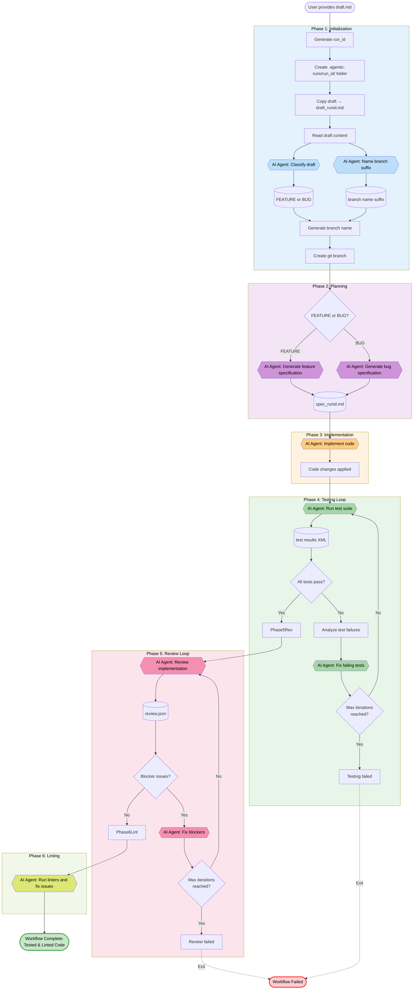

# Agentic Development Workflow (ADW)

An AI-powered complete development workflow automation system that takes you from idea to tested implementation. Transform a draft document into fully implemented, tested, reviewed, and linted code through an automated six-phase process: initialization, planning, implementation, testing, review, and linting.

## Overview

ADW orchestrates an end-to-end development workflow using AI agents. From a single draft file, it automatically classifies your idea, creates a git branch, generates a detailed specification, implements the code, and runs tests until they pass—all in one command.

## Workflow Phases

When you run `adw_init_plan_implement_test_lint.py`, the system executes six phases:

The following diagram illustrates the complete workflow:



### Phase 1: Initialization

1. **Generate Run ID**: Creates a unique identifier for the workflow run
2. **Create Run Folder**: Sets up a dedicated folder in `.agentic-runs/`
3. **Copy Draft**: Copies your draft file into the run folder
4. **Read Draft**: Loads the draft content for processing
5. **Classify Draft**: Uses AI to determine if it's a FEATURE or BUG
6. **Generate Branch Name**: Creates a semantic branch name based on draft content
7. **Create Branch**: Creates and checks out a new git branch

### Phase 2: Planning

1. **Generate Specification**: Creates a detailed technical spec from your draft
2. **Save Spec File**: Stores the specification in the run folder

### Phase 3: Implementation

1. **Implement Code**: AI agents write code based on the specification
2. **Verify Implementation**: Ensures code changes align with the spec

### Phase 4: Testing

1. **Run Tests**: Executes the test suite
2. **Analyze Failures**: Identifies and diagnoses test failures
3. **Fix Issues**: Automatically fixes failing tests
4. **Loop**: Repeats until all tests pass or max iterations reached

### Phase 5: Review

1. **Review Implementation**: AI agent validates code against specification
2. **Identify Issues**: Detects blocker and non-blocker issues
3. **Fix Blockers**: Automatically fixes blocker issues
4. **Loop**: Repeats until no blocker issues remain or max iterations reached

### Phase 6: Linting

1. **Run Linters**: Executes code quality and style checks
2. **Analyze Issues**: Identifies linting violations
3. **Fix Violations**: Automatically fixes code quality issues
4. **Verify**: Ensures all linting checks pass

## Setup

1. Copy the content of this repository to the location of your project. The agentic layer lives next to the project it helps to build, typically at the root of your project.

2. Copy the example environment file:

```bash
cp .env.example .env
```

3. Configure your environment variables in `.env`:

```
RUN_DIRECTORY=./.agentic-runs
```

**Note**: Authentication is handled automatically through the Claude Code Agent. Ensure you have Claude Code Agent installed and authenticated before running ADW.

4. **(Optional but Important)** Configure `.claude/commands/` to match your project's needs:

The agentic layer uses Claude Code slash commands defined in `.claude/commands/`. To get the best results, customize these commands to specify:
- Your testing framework (e.g., pytest, jest, vitest)
- Your linting tools (e.g., ruff, eslint, prettier)
- Other technologies and conventions specific to your project

This tailors the AI agents to work optimally with your specific tech stack and project structure.

5. Ensure you have Python 3.13+ and required dependencies (managed via inline script metadata)

## Usage

### Complete Workflow (Recommended)

Execute the entire workflow from draft to tested implementation:

```bash
uv run .agentic-layer/adw_init_plan_implement_test_lint.py --draft path/to/your/draft.md
```

### With Custom Run ID

```bash
uv run .agentic-layer/adw_init_plan_implement_test_lint.py --draft path/to/your/draft.md --run_id my_custom_id
```

### With Issue ID

```bash
uv run .agentic-layer/adw_init_plan_implement_test_lint.py --draft path/to/your/draft.md --issue_id ISSUE-123
```

### Select Agent

```bash
uv run .agentic-layer/adw_init_plan_implement_test_lint.py --draft path/to/your/draft.md --agent copilot
uv run .agentic-layer/adw_init_plan_implement_test_lint.py --draft path/to/your/draft.md --agent claude
```

### Individual Phase Scripts

You can also run individual phases separately:

- **Initialization only**: `uv run .agentic-layer/adw_init.py --draft path/to/draft.md`
- **Planning only**: `uv run .agentic-layer/adw_plan.py --run_id <run_id> --draft path/to/draft.md`
- **Implementation only**: `uv run .agentic-layer/adw_implement.py --run_id <run_id> --spec path/to/spec.md`
- **Testing only**: `uv run .agentic-layer/adw_test_loop.py --test_folder path/to/tests --spec path/to/spec.md`

## Testing

The project uses pytest for unit testing. Run all tests with:

```bash
uv run pytest
```

Tests are located in the `tests/` directory following pytest naming conventions (`test_*.py`).
